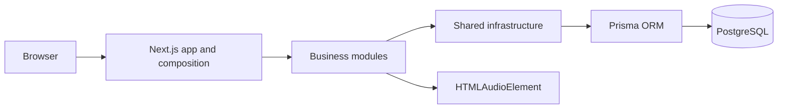
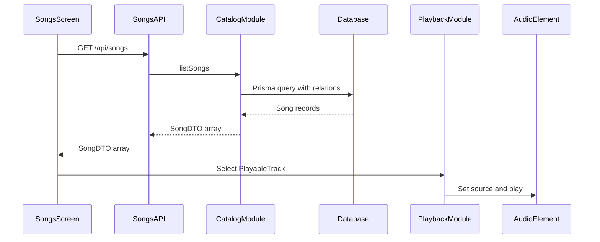

# Application architecture

## Purpose

This document describes the application's current architecture and the forces shaping it. It is a lightweight, revisable baseline rather than a complete specification. Meaningful changes should be recorded in focused Architecture Decision Records. Module ownership, public APIs, and import rules live in [modular architecture](./modular-architecture.md).

## Business and learning goals

The product goal is to let a listener browse a music library, select a song, control playback, and follow synchronized lyrics. Playlists, search, favorites, and authenticated personal libraries are possible future capabilities.

The engineering goal is to use one real product as a learning vehicle for full-stack development, frontend architecture, API design, database design, product thinking, and communication of tradeoffs.

## Current constraints

* The project is maintained as a side project by one developer.
* Features should ship incrementally and remain easy to understand.
* Current traffic and team size do not justify independently deployed services.
* Architecture should support learning and credible interview discussion without introducing speculative production complexity.
* Audio playback runs in the browser and must remain responsive across route changes.

## Quality attributes

The current priorities are:

1. **Maintainability:** feature ownership, dependencies, and data contracts should be understandable.
2. **Learning clarity:** architectural choices and their consequences should be explicit.
3. **Reliability:** loading, empty, error, retry, playback, and seek behavior should be predictable.
4. **Type safety:** database queries and API responses should have intentional types.
5. **Interactive performance:** high-frequency playback updates should not invalidate unrelated UI.
6. **Testability:** business and transformation logic should be separable from UI and infrastructure as the application grows.
7. **Accessibility:** controls should be keyboard-accessible and communicate their purpose.
8. **Developer experience:** local setup, migrations, seeding, linting, and builds should remain straightforward.

Scalability currently means keeping boundaries clear enough to evolve the monolith, not preparing for internet-scale traffic.

## System style

The application is a modular monolith built with the Next.js App Router. Frontend pages, server route handlers, shared contracts, and database access live in one deployable application.

This style is appropriate because the codebase, team, and operational requirements are small. Splitting the system into services would add deployment, networking, authentication, observability, and consistency costs without solving a current product problem.

## Main boundaries

### Presentation

Next.js pages and React components render the interface. Chakra UI 3 provides the component and styling system. The protected player layout owns persistent application chrome: navigation and the bottom player. See [the modular architecture guide](./modular-architecture.md) for capability ownership and dependency rules.

### Playback

The playback module's `PlaybackProvider` owns the shared playback session and low-frequency commands. The browser audio element is the source of truth for playback position. High-frequency display state remains local to the player and lyrics components, as recorded in [ADR 0001](../adr/0001-playback-state-boundary.md).

### API

Next.js route handlers are the network boundary between browser code and server-only modules. They own HTTP status codes and error responses while delegating business rules, queries, and record mapping to module services.

The catalog module maps Prisma results to `SongDTO`. This keeps database join-table details and unused fields out of the client contract. Timed lyrics are stored as JSON on `Song` and included in that read model.

### Persistence

Prisma provides type-safe server-side database access and migrations for PostgreSQL. Prisma is not the API layer or the client-side fetching solution; modules own persistence behavior and Route Handlers adapt it to HTTP.

### Authentication

The auth module registers and authenticates users and manages an HTTP-only JWT cookie. Public authentication pages use the root shell without player controls. A protected server layout verifies the cookie before rendering player pages, and protected APIs verify the same session independently. Sign-out expires the cookie, as recorded in [ADR 0002](../adr/0002-cookie-session-route-boundary.md).

## Current data flow

## Rendering strategy

Next.js supports server rendering, React Server Components, static generation, and metadata, but those capabilities are not automatically benefits.

The current songs page is client-rendered because it owns interactive loading, error, retry, selection, playback, and lyrics behavior. Public pages that need search indexing or faster first content may later use server rendering. Authenticated, highly interactive screens may reasonably remain client-heavy.

Rendering should be selected per route based on user value, SEO requirements, caching, personalization, and interaction needs.

## Client data fetching

The songs page currently uses native `fetch` with explicit loading, error, empty, and retry states.

SWR is an open option, not a current decision. It becomes valuable when the product needs cache sharing, deduplication, automatic revalidation, stale-while-revalidate behavior, or consistent request conventions across several client features. Adding it before those requirements would replace understandable local code with an abstraction that has not yet earned its cost.

## Current decisions

* Use a Next.js modular monolith rather than separate frontend and backend deployments.
* Keep discovered business capabilities in `src/modules`, domain-neutral infrastructure in `src/shared`, and routing or cross-capability composition in `src/app`.
* Use PostgreSQL with Prisma for persistence and type-safe server-side queries.
* Use explicit API DTOs where data crosses the server/client boundary.
* Use Chakra UI 3 as the UI component system.
* Keep public authentication pages separate from the protected player layout.
* Protect player pages and music APIs with a server-verified HTTP-only cookie session.
* Keep persistent playback controls in the protected player layout.
* Keep low-frequency playback state global and high-frequency derived display state local.
* Keep the existing manual songs fetch until caching or revalidation requirements justify a library.

## Non-goals

* Microservices or independently deployed backend services
* Premature infrastructure for high-scale traffic
* A universal repository/service abstraction around every Prisma query
* ADRs for reversible implementation details
* Selecting one rendering strategy for every route

## Open decisions

These should be decided when a concrete feature creates the requirement:

* Which routes need server rendering, static generation, metadata, or SEO?
* How should authentication be verified and protected across pages and APIs?
* When do client caching and revalidation justify SWR or another data library?
* Should lyrics stay on the song list payload, or load only after a song is selected?
* What validation library and error contract should API routes share?
* What automated testing mix provides the most value?
* Where will the application, database, and audio assets be deployed?
* When should playlists, search, and favorites become real feature boundaries?
